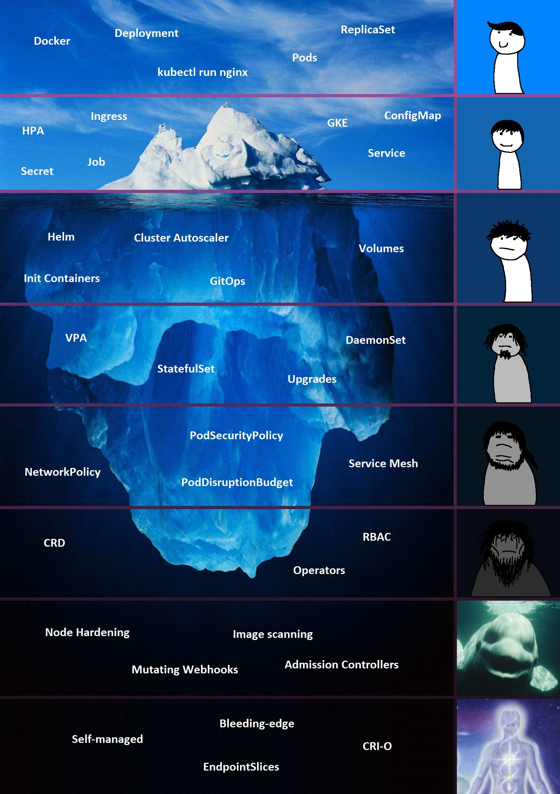

# Home

#### Why I made this book

Kubernetes \(k8s\) is eating the world. Every major cloud provider has a managed Kubernetes service, making rolling your own cluster \(Kubernetes setup\) less and less attractive. Even still, having a basic understanding of how Kubernetes works is really helpful for developers.

While the learning curve is steep, there are lots of really good resources and courses that cover EVERYTHING Kubernetes has to offer. Personally, I find this learning approach gruling and it takes a long time to get anything meaningful setup. I'm more of a "put me in the game coach" type of person, if I have a direction of what I want to do, I'll struggling through, read docs, debug, and ask questions until I get where I want to go.

There are also a ton of "how-to" tutorials online to deploy certain things but every kubernetes setup is slightly different. Here I hope you will have an end-to-end solution with suggestions about areas you can dig in deeper.

Image from [Reddit](https://www.reddit.com/r/kubernetes/comments/nfbqag/kubernetes_isnt_that_hard_they_said_youll_have_no/).

#### The Goal

One fun way to learn is building your own **"home lab"**, a place to build apps, self-host cool tools you find online and live privately, all while gain experience with Kubernetes!

Like a chose your own adventure book, there are multiple different types of homelabs you can build. You can pick and choose which guides you want to build, where each one will have opportunities to explain the key Kubernetes concepts.

#### Acknowledgements

Shoutout to [Tyler](https://github.com/01100010011001010110010101110000), who started me on this journey and regularly pairs with me. I hope to keep passing on what I've learned here.

