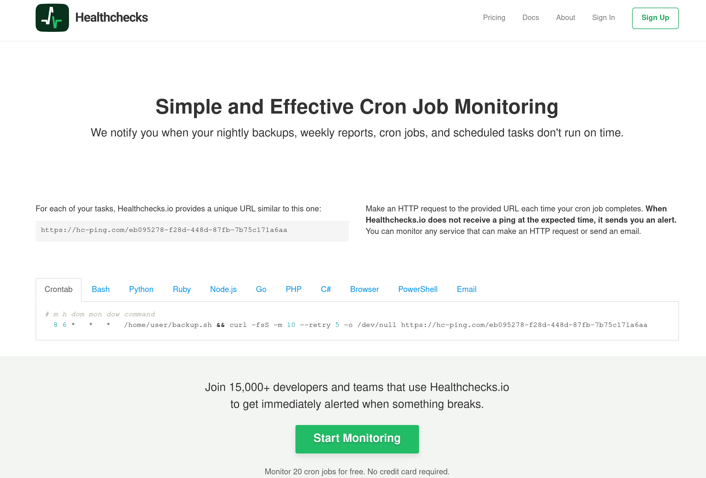
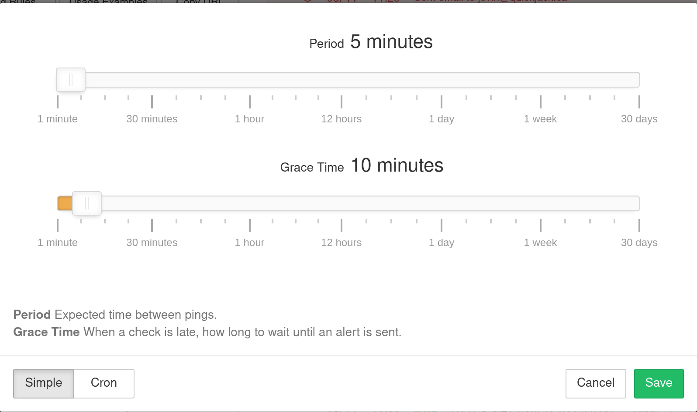

# Adding Internet Health Monitor

Healthchecks is a really nice SaaS that you can set up to expect an HTTP call at a set interval, and send you a notification if it didn't get it. This could be helpful for detecting a number of things:

* Your k8s cluster is broken
* Your internet or power is out

They have a free tier which is good enough for what we are doing. Let's visit their site [https://healthchecks.io/](https://healthchecks.io/) and Sign Up



Once you sign up, create a new "check" and change the schedule so it expects to receive a request every 5 minutes:



Awesome! Now the fun part. Let's start by created a directory structure you want. This is only to keep you organized, and nothing about this structure is important for Kubernetes:

```text
$ mkdir -p networking/healthcheck
$ cd networking/healthcheck
```

In the future, we will be making `Deployment` Kubernetes Objects, but here we just want something SUPER simple. So we will use the `CronJob` Kubernetes Object. Create a file called `cronjob` and paste this in it:

```text
apiVersion: batch/v1beta1
kind: CronJob
metadata:
  name: healthcheck
spec:
  schedule: "*/5 * * * *"
  jobTemplate:
    spec:
      template:
        spec:
          containers:
          - name: healthcheck
            image: curlimages/curl
            imagePullPolicy: IfNotPresent
            command:
            - /usr/bin/curl
            - -fsS
            - -m 10
            - https://hc-ping.com/<the url from healthcheck>
          restartPolicy: Never

```

TODO: Explain this

