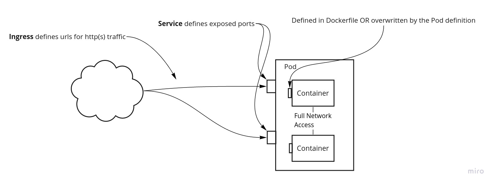

# Foundational Concepts

### Storage in Kubernetes vs Docker

In Docker, you have to explicitly tell the container what directory you want to host a volume. Say you want to run an instance of Plex on your machine and you want to keep the configuration persistent and not vaporize every time you restart the container. The storage is often local directory. You would run something like this right?

```text
 $ docker run plexinc/pms-docker -v /path/to/library:/config
```

With Kubernetes you don't specify WHERE you want to store the data directly, it decouples this for you. Instead you specify all the different places where you can store data \(an NFS store, AWS S3, a local SD card\) and then for each application you deploy, you specify the amount of space you want and which directory it should be mapped to. Kubernetes does the magic to create a folder on the storage location and mounts that for the container.

* The locations that you have available to store data is called "Persistent Volumes" \(PVs\)
* When you specify the amount of storage you need for an application, and any other contrainsts these are called "Persistent Volume Claims" \(PVCs\). You later connect these PVCs to directories in the application in the "Deployments" 

Here is an example PVC I use to hold my configuration files for my Adguard setup:

```text
# Adguard-pvc.yaml
apiVersion: v1
kind: PersistentVolumeClaim
metadata:
  name: adguard-conf
spec:
  accessModes:
    - ReadWriteOnce
  storageClassName: nfs-client
  resources:
    requests:
      storage: 1Gi
```

Notice how you don't even specify the directory? We map this PVC to the application in the Deployment later.

### Picking a Server to Deploy to in Kubernetes vs Docker

When deploying an application in Docker, you log into that machine \(or use Docker Machine\) and run your docker command on that machine. With Kubernetes, you can have many machines \(nodes\) and it treats them equally and will pick one to run your application. It manages all the routing between machines so you don't care which machine it lives on. Some key concepts to know:

* **Nodes** - Instead of "machines" or "servers", k8s calls them nodes. You can have "worker" nodes that will run your applications and "master" nodes which are there to run the main kubernetes orchestration. You can have nodes run both.
* **Pods** - Pods are groups of containers that work together as a single application. Usually pods only contain a single container, but I have examples where I have two containers in a pod. For example, you want all your torrent traffic to go through a VPN, you can have the transmission container routing traffic through a VPN container. For this use case, you would only want to deploy them as a single "application", so you would release them as a single pod.
* **Containers** - The same thing as docker.

### Networking in Kubernetes vs Docker

With Docker, you only have to update the ports that you want the Docker container to connect to. With that Plex example you would do:

```text
$ docker run plexinc/pms-docker -p 32400:32400 -p 1900:1900/udp
```

Then you just have to make sure the firewall on that machine is allowing the packets through and you are golden.

With Kubernetes there are a number of additional layers that each serve a purpose. They have an [image on their site](https://kubernetes.io/docs/concepts/services-networking/ingress/#what-is-ingress), but I don't think it's the best way to convey the concept so I made my own! 



We will get to the actual definitions later, but for now:

* Ports on each of the containers should already be defined in the Docker image already. If not, you can specify the ports that container should serve up in the deployment definition file. You probably won't have to do this often.
* **Services** - These expose the ports you want to the pod to offer up for others to connect to. This would be a lot like the port mapping you do with the Docker example above but there is lots of nuance there that we won't get into. Lots more you can learn on the [official docs](https://kubernetes.io/docs/concepts/services-networking/service/). You can connect to these ports directly after you specify them.
* **Ingress** - This gives some nice features to you http\(s\) traffic and connects it up to your **services.** You can add URLs you want as well as other features.

